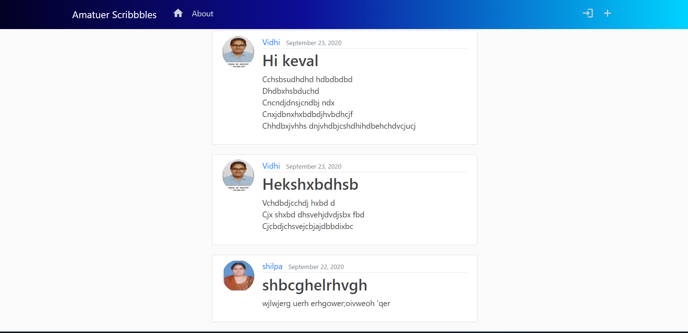
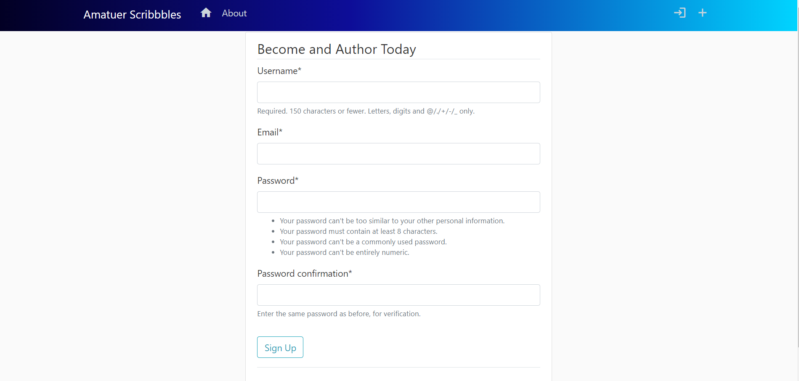
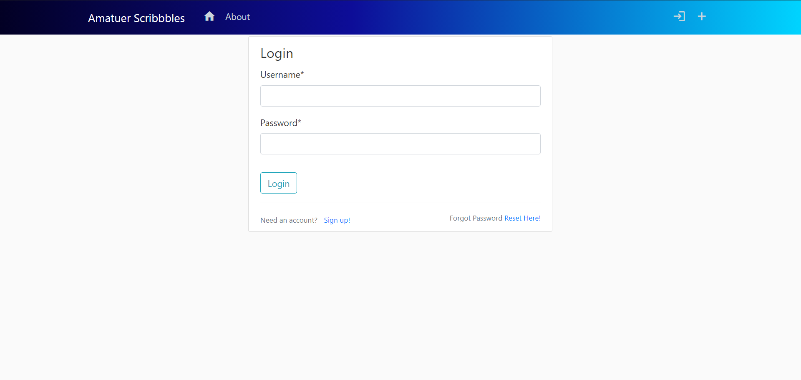
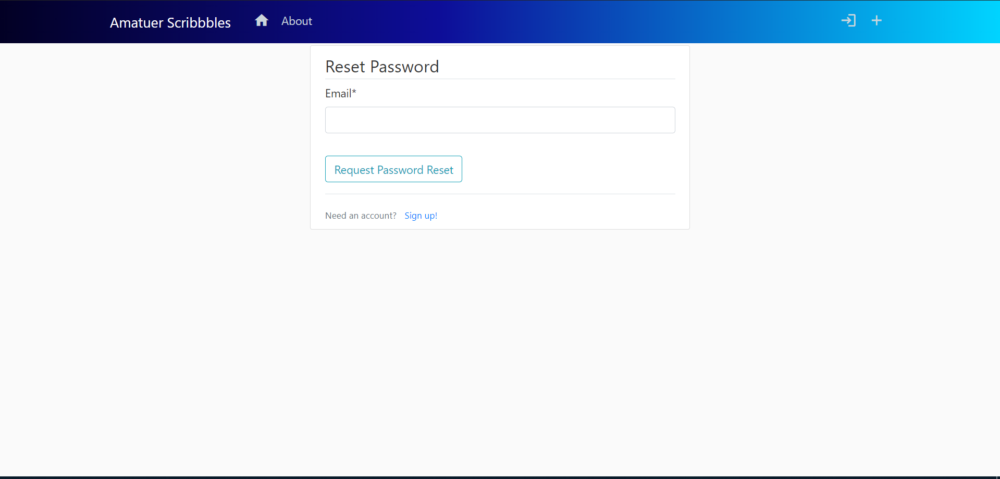
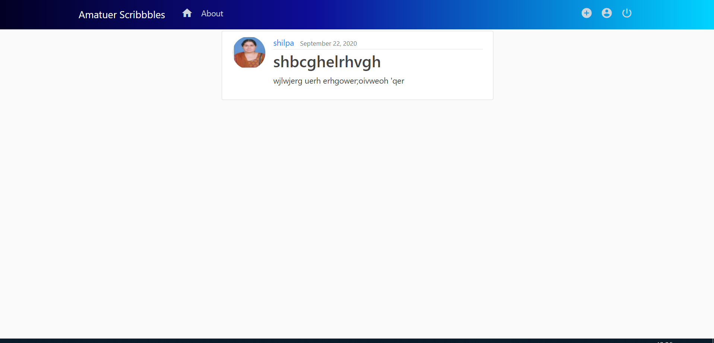
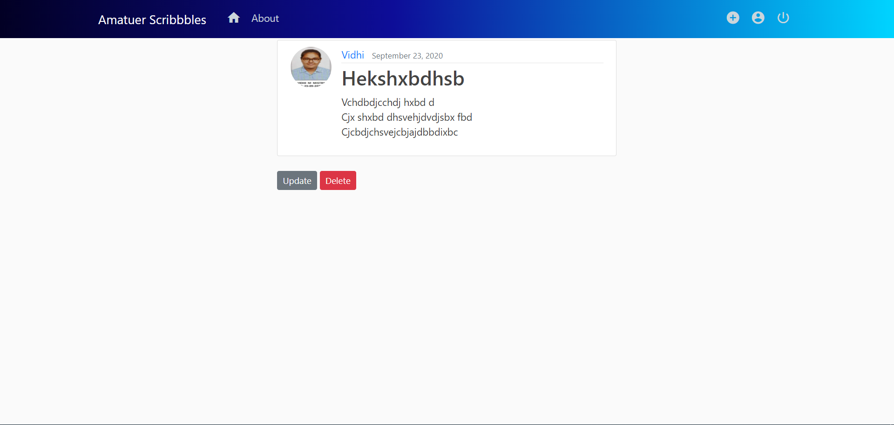
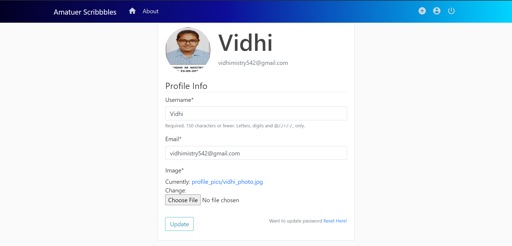

# Django_blog
This project was made with a goal of learning django and web development. I am not a professional programmer, and this is my attempt to making somethings amazing.

The following are the views to the blog application
1. This is the view that one is welcomed with when they open this website for the first time.

2. This the register view for new users 

3. This is the login page for exsisting users

4. If the user has forgot the password, then this is the view they are going to see once they click on the forgot password link on the login page 

5. If the author is logged an is viewing a post by someone else, then this is the kind of view they see...

6. If the author is logged in and is viewing a post by themselves, this is the additional options they are going to see..

7.This is the view the user is greated with is they are willing to updat their profile.

NOTE: The users can also change from their profile views, hence for security reasons they can also demand password reset after being logged in!!
